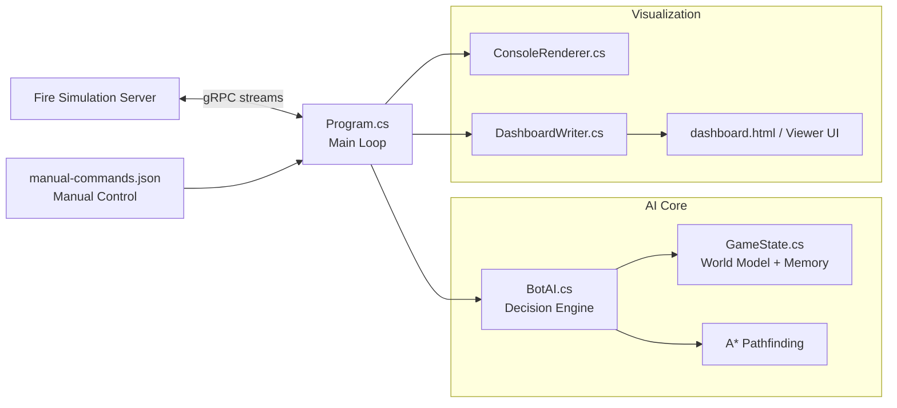
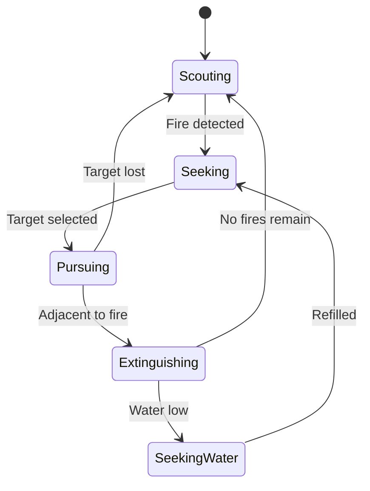

# bitWiser Firefighting AI Bot

A multi-agent C# firefighting bot for the **FireRA** grid simulation. The client connects to a remote game server over **gRPC streaming**, maintains a shared world model, and coordinates a drone, fire truck, and firefighter to locate and extinguish fires. A live 2D dashboard provides real-time visualization of AI decisions, map knowledge, and unit actions.

## Table of Contents
- [Overview](#overview)
- [Key Capabilities](#key-capabilities)
- [Architecture](#architecture)
- [Project Structure](#project-structure)
- [Getting Started](#getting-started)
- [Configuration](#configuration)
- [Dashboard & Visualization](#dashboard--visualization)
- [Manual Control](#manual-control)
- [Contributing](#contributing)
- [License](#license)

## Overview
bitWiser implements a strategic AI brain for a grid-based firefighting simulation. Every tick, the bot ingests streamed world updates, updates memory, selects roles and targets, and issues commands to each unit while respecting water, line-of-sight, and terrain constraints.

**Units**
- **Drone / Copter**: high-visibility scout for rapid exploration and early fire detection.
- **Fire Truck**: high-capacity unit that handles heavy firefighting and refilling cycles.
- **Firefighter**: agile ground unit that attacks fires aggressively without refilling.

## Key Capabilities
- **Role-based coordination** to keep units spread across exploration sectors.
- **Persistent memory** of fires, water sources, explored cells, and assignments.
- **A\* pathfinding** with obstacle, teammate, and water-entry rules.
- **Water management** for refill planning and critical-threshold recovery.
- **Stuck detection and recovery** to avoid deadlocks and loops.
- **Live dashboard** for debugging and visualizing decisions.

## Architecture

### System Context


### AI Decision Flow


### Core Components
| Component | Responsibility |
|---|---|
| `Program.cs` | gRPC client loop, command dispatch, manual override routing |
| `BotAI.cs` | Decision logic, role behavior, scoring, target assignment |
| `GameState.cs` | Shared memory: map knowledge, known fires/water, assignments |
| `ConsoleRenderer.cs` | Console status rendering and debug output |
| `DashboardWriter.cs` | Writes dashboard state for browser visualization |
| `Proto/` | gRPC protocol definitions |

## Project Structure
```
.
├─ Assets/
├─ Proto/
├─ Viewer/
│  └─ bitview/
├─ BotAI.cs
├─ ConsoleRenderer.cs
├─ DashboardWriter.cs
├─ GameState.cs
├─ Models.cs
├─ Program.cs
├─ FireClient.csproj
├─ FireClient.sln
├─ dashboard.html
└─ manual-commands.json
```

## Getting Started

### Prerequisites
- **.NET SDK 10.0+**
- Access to a running FireRA simulation server (gRPC)

### Build
```bash
dotnet build
```

### Run
```bash
dotnet run
```

> The client must be able to reach the gRPC server defined in `Program.cs`.

## Configuration
Update the constants in `Program.cs` to match your environment:

| Setting | Default | Purpose |
|---|---|---|
| `teamName` | `Bitwiser` | Team name used when registering with the server |
| `serverAddress` | `http://10.4.4.59:5001` | FireRA gRPC endpoint |
| `manualCommandPath` | `manual-commands.json` | Manual control input file |
| `TargetOutgoingCommandsPerSecond` | `24` | Command rate limiting |
| `CommandsPerSendWindow` | `1` | Commands per dispatch window |

## Dashboard & Visualization
The dashboard renders the simulation state in 2D with unit paths, fires, explored areas, and AI intent.

- **Browser UI**: open `dashboard.html` (or the `Viewer/bitview` UI, if preferred).
- **State source**: `DashboardWriter` emits the dashboard state during runtime.

## Manual Control
Manual override is read from `manual-commands.json`. Toggle `manualMode` and submit commands for specific unit IDs to temporarily override the AI.

- `manualMode: true` enables manual control.
- `commands` should contain the latest command payloads for units.

## Contributing
Pull requests are welcome. Please keep changes focused, include relevant documentation updates, and validate with `dotnet build` before submitting.

## License
Licensed under the [MIT License](LICENSE).
